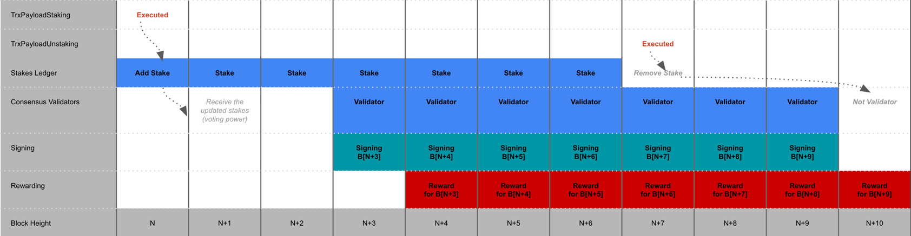

# Rewards

Block[N]
- `TrxPayloadStaking` 실행 => 지분 추가 (not commit).
- 현재의 지분 원장(Block[N-1]에서 커밋된 원장) 기준으로 Validator 변경 목록을 합의 엔진으로 리턴.  
> Consensus engine  
> - 현재의 NextValidatorSet을 다음 블록(Block[N+1]) ValidatorSet 으로 변경.  
> - 리턴 받은 Validator 변경 목록으로 NextValidatorSet 구성
- 지분 원장 commit (현재 블록에서 변경된 지분 정보는 다음 블록 처리시 합의 엔진으로 리턴됨)

Block[N+1]
- 현재의 지분 원장(Block[N]에서 커밋된 원장, `TrxPayloadStaking` 실행 결과 반영된 원장) 기준으로 Validator 변경 목록을 합의 엔진으로 리턴.  
> Consensus engine
> - 현재의 NextValidatorSet을 다음 블록(Block[N+1]) ValidatorSet 으로 변경.
> - 리턴 받은 Validator 변경 목록으로 NextValidatorSet 구성 => 지분 변경 반영된 ValidatorSet
- 지분 원장 commit

Block[N+2]
- 현재의 지분 원장(Block[N+1]에서 커밋된 원장, 변경사항 없음) 기준으로 Validator 변경 목록을 합의 엔진으로 리턴.  
> Consensus engine
> - 현재의 NextValidatorSet을 다음 블록(Block[N+1]) ValidatorSet 으로 변경. => 지분 변경 반영된 ValidatorSet
> - 리턴 받은 Validator 변경 목록으로 NextValidatorSet 구성
- 지분 원장 commit

Block[N+3]
- 변경된 ValidatorSet 에 의해 서명된 블록.

Block[N+4]
- Block[N+3] 에 서명한 Validators 보상.

